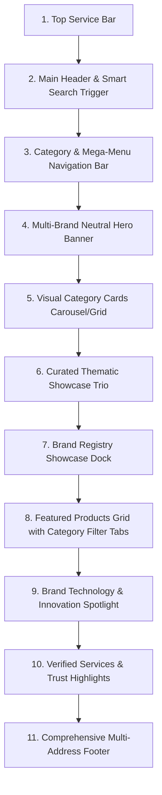
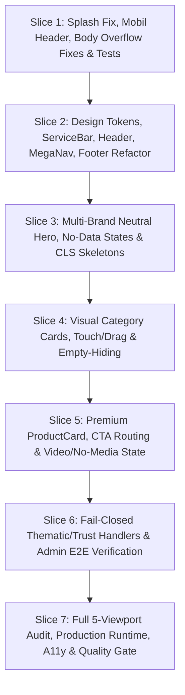

# Sahara Electronics — Storefront Vizual İstiqamət və İcra Planı (v1)

> [!IMPORTANT]
> **Sənəd Növü:** Vizual Arxitektura, Dizayn Sistemi və Storefront İcra Planı  
> **Status:** Şərti Təsdiqlənmiş / İcraya Başlanmış (v1 Final Technical Refinement)  
> **Branch:** `saharasitedev` (Təcrid olunmuş və qorunan mühit)  
> **Referans Mənbə:** `/home/oni10/Desktop/ChatGPT Image 12 Eyl 2026 10_16_48.png` (Yalnız dizayn keyfiyyəti, kompozisiya, səhifə ritmi, bölmə sırası və mobil/desktop yanaşması üçün vizual referansdır).

---

## 1. Hazırkı Storefront UI-nin Faktiki Audit Nəticələri və Sübutları

Playwright vasitəsilə 5 fərqli ekranda (390×844 mobil, 768×1024 planşet, 1024×768 laptop, 1440×900 desktop, 1920×1080 böyük ekran) real brauzer auditi icra olunmuş və faktiki screenshot sübutları qeydə alınaraq layihədaxili davamlı qovluqda saxlanılmışdır:

### 1.1 Faktiki Screenshot Sübutları (`site/docs/audits/storefront-before/`)

- **390×844 Mobil (Light & Dark):**
  - Light Full: [`site/docs/audits/storefront-before/390x844-mobile-light-full.png`](file:///home/oni10/Desktop/ArdoKataloq/site/docs/audits/storefront-before/390x844-mobile-light-full.png)
  - Dark Full: [`site/docs/audits/storefront-before/390x844-mobile-dark-full.png`](file:///home/oni10/Desktop/ArdoKataloq/site/docs/audits/storefront-before/390x844-mobile-dark-full.png)
- **768×1024 Planşet (Light & Dark):**
  - Light Full: [`site/docs/audits/storefront-before/768x1024-tablet-light-full.png`](file:///home/oni10/Desktop/ArdoKataloq/site/docs/audits/storefront-before/768x1024-tablet-light-full.png)
  - Dark Full: [`site/docs/audits/storefront-before/768x1024-tablet-dark-full.png`](file:///home/oni10/Desktop/ArdoKataloq/site/docs/audits/storefront-before/768x1024-tablet-dark-full.png)
- **1024×768 Laptop (Light & Dark):**
  - Light Full: [`site/docs/audits/storefront-before/1024x768-laptop-light-full.png`](file:///home/oni10/Desktop/ArdoKataloq/site/docs/audits/storefront-before/1024x768-laptop-light-full.png)
  - Dark Full: [`site/docs/audits/storefront-before/1024x768-laptop-dark-full.png`](file:///home/oni10/Desktop/ArdoKataloq/site/docs/audits/storefront-before/1024x768-laptop-dark-full.png)
- **1440×900 Desktop (Light & Dark):**
  - Light Full: [`site/docs/audits/storefront-before/1440x900-desktop-light-full.png`](file:///home/oni10/Desktop/ArdoKataloq/site/docs/audits/storefront-before/1440x900-desktop-light-full.png)
  - Dark Full: [`site/docs/audits/storefront-before/1440x900-desktop-dark-full.png`](file:///home/oni10/Desktop/ArdoKataloq/site/docs/audits/storefront-before/1440x900-desktop-dark-full.png)
- **1920×1080 Böyük Ekran (Light & Dark):**
  - Light Full: [`site/docs/audits/storefront-before/1920x1080-large-light-full.png`](file:///home/oni10/Desktop/ArdoKataloq/site/docs/audits/storefront-before/1920x1080-large-light-full.png)
  - Dark Full: [`site/docs/audits/storefront-before/1920x1080-large-dark-full.png`](file:///home/oni10/Desktop/ArdoKataloq/site/docs/audits/storefront-before/1920x1080-large-dark-full.png)

### 1.2 Faktiki Çatışmazlıqların Matrisi

| #     | Faktiki Problem                                       | Viewport / Komponent                       | Real Təsiri                                                                                                                                                                            |
| :---- | :---------------------------------------------------- | :----------------------------------------- | :------------------------------------------------------------------------------------------------------------------------------------------------------------------------------------- |
| **1** | **Mobil Header və Axtarışın Kəsilməsi**               | 390×844 Mobil (`SiteHeader.tsx`)           | Axtarış sahəsi (`.search-input-wrapper`) mobil ekranda sağ tərəfdən kəsilir və ekran enini aşır; "Kateqoriyalar" düyməsi ilə loqo bir-birini sıxır.                                    |
| **2** | **Təsirli və Neytral Hero Kompozisiyasının Olmaması** | Bütün ekranlar (`HomePage.tsx`)            | Səhifə birbaşa 3 statik brend qutusu ilə başlayır. İstifadəçini qarşılayan geniş, çoxbrendli, neytral və premium Hero banner yoxdur.                                                   |
| **3** | **Qeyri-Vizual Kateqoriya Blokları**                  | Bütün ekranlar (`BrandCategoryFilter.tsx`) | Kateqoriyalar yalnız qırmızı alov ikonu olan sadə qutulardır. 0 modeli olan kateqoriyalar ("Sobalar 0 Model") lazımsız yer tutur.                                                      |
| **4** | **Məhsul Kartlarının Zəif İyerarxiyası**              | Desktop & Mobil (`ProductCard.tsx`)        | Kartlar vitrin məhsulu deyil, köhnə kataloq cədvəli təəssüratı yaradır: böyük "Şəkil yoxdur" boşluqları, yanaşı qoyulmuş yaşıl WhatsApp və qırmızı Zəng düymələri vizual xaos yaradır. |
| **5** | **Dinamik Tematik Vitrin Bölməsinin Yoxluğu**         | Bütün ekranlar (`HomePage.tsx`)            | Məqsəd əsaslı (məsələn: mətbəx, iqlim, rahatlıq) idarə olunan tematik vizual vitrin bölməsi mövcud deyil.                                                                              |
| **6** | **Açılış Ekranında Mətn Çərçivəsi Xətası**            | Bütün ekranlar (`index.html` splash)       | Loqo animasiyası və halqası qaydasında olsa da, `.sahara-splash-brand` daxilində səhifə yenilənərkən `SAHARA ELECTRONICS` mətninin ətrafında qara dördbucaq çərçivə xətası yaranır.    |
| **7** | **Kompaktlıq və Mobil Uyğunlaşma Uyğunsuzluğu**       | 390px Mobil & 768px Planşet                | Desktop komponentləri mobil üçün xüsusi layihələndirilməyib, sadəcə CSS ilə sıxışdırılıb.                                                                                              |
| **8** | **Qeyri-Bərabər Şəkil Təqdimatı**                     | Bütün ekranlar (`ShimmerImage.tsx`)        | Şəkillər olmadıqda və ya yüklənərkən 1:1 karkas dəqiq oturmur, boşluq hissi yaradır.                                                                                                   |

---

## 2. Referans Şəkildən Götürüləcək Prinsiplər

Referans şəkildə (`ChatGPT Image 12 Eyl 2026 10_16_48.png`) nümayiş olunan yüksək səviyyəli dizayn təcrübəsindən Sahara Electronics üçün aşağıdakı **arxitektur və dizayn prinsipləri** mənimsənilir:

1. **Dəqiq Səhifə Ritmi və Hündürlük Balansı:**
   - Hər bölmə arasında nəfəs alan, lakin həddən artıq boşluq yaratmayan ritmik spacing (`32px` – `48px`).
2. **Qara/Ağ Əsas və Nəzarətli Qırmızı Vurğu (Sahara Red `#dc2626` / `#ef4444`):**
   - Fon və kartlar təmiz neytral tonlarda (Light: `#ffffff`, `#f8fafc`, Dark: `#0d1117`, `#161b22`).
   - Qırmızı rəng yalnız əsas CTA düymələrində, aktiv tablarda və zəruri status göstəricilərində tətbiq olunur.
3. **Zəngin Şəkil Əsaslı Kateqoriya Kartları:**
   - Sadə ikonlar əvəzinə məhsul ailəsini təmsil edən real şəkillərlə vizual kateqoriya qutuları.
4. **3-lü Tematik Vitrin (Curated Thematic Showcase Trio):**
   - Səhifənin mərkəzində 3 vizual kart kompozisiyası (yalnız təsdiqlənmiş məlumat olduqda).
5. **Ayrıca Mobil Kompozisiya:**
   - Mobildə yuxarı header-in sadələşdirilməsi, horizontal sürüşdürmə (swipeable) kateqoriya lenti və tək-sütunlu oxunaqlı məhsul axını.

---

## 3. Referansdan Qətiyyən Köçürülməyəcək Məlumat və Funksiyalar

> [!WARNING]
> Sahara Electronics üçün saxta məlumat, uydurma iddia və olmayan funksiyaların daxil edilməsi qəti qadağandır:

- **SABAT brendi və loqosu:** Qətiyyən istifadə olunmur. Yalnız orijinal **Sahara Electronics** kimliyi tətbiq olunur.
- **Qiymət, Səbət və Checkout:** Qiymətlər (`1,899 ₼`), "Səbətə at", "İndi al", "Kreditlə al" göstərilmir. Əvəzində: **"Ətraflı bax"**, **"WhatsApp"** və **"Zəng et"** əməliyyatları təqdim olunur. Master plana əsasən e-ticarət (commerce) Mərhələ 12-dir və hazırkı model yalnız məsləhət və kataloq yönümlüdür.
- **Uydurma Marketinq və Kommersiya İddiaları:** "Xüsusi endirimlər sizi gözləyir", "Faizsiz kredit", "Pulsuz çatdırılma", "30% qaz qənaəti", "dünya standartı", "yüksək enerji səmərəliliyi", "rəsmi zəmanət", "texniki dəstək", "rəsmi kataloq" kimi təsdiqlənməmiş iddialar yazılmır. Admin/DB-də mətn yoxdursa neytral və ya fail-closed gizlənmə tətbiq olunur.
- **Təsdiqlənməmiş Tək-Brend Fokuslanması:** ARDO yönümlü hardcoded mətnlər yazılmır; bütün aktiv brendlər (ARDO, Lotus, Artel) faktiki publication/status qaydasına uyğun təqdim olunur (`comingSoon` olanlar "Tezliklə" statusunda qalır).
- **Uydurma Məhsul və Stok:** Bazada mövcud olmayan televiziya, noutbuk və s. kateqoriyalar uydurulmur; yalnız bazadakı aktiv kateqoriyalar və məhsullar əks olunur.

---

## 4. Dizayn Sistemi və Tokenlər (Design Tokens)

Mövcud Phase 1 dizayn tokenlərini genişləndirən, konflikt yaratmayan vahid token arxitekturası:

```css
:root {
  /* Layout & Container */
  --container-max-width: 1440px;
  --container-gutter-desktop: 32px;
  --container-gutter-tablet: 24px;
  --container-gutter-mobile: 16px;

  /* Neutrals & Surfaces (Light) */
  --sahara-bg-base: #f8fafc;
  --sahara-bg-surface: #ffffff;
  --sahara-bg-subtle: #f1f5f9;
  --sahara-bg-overlay: rgba(15, 23, 42, 0.6);
  --sahara-border-subtle: #e2e8f0;
  --sahara-border-strong: #cbd5e1;

  /* Typography Colors (Light) */
  --sahara-text-primary: #0f172a;
  --sahara-text-secondary: #475569;
  --sahara-text-muted: #64748b;
  --sahara-text-inverse: #ffffff;

  /* Brand Accents */
  --sahara-red-primary: #dc2626;
  --sahara-red-hover: #b91c1c;
  --sahara-red-subtle: rgba(220, 38, 38, 0.08);
  --sahara-red-border: rgba(220, 38, 38, 0.25);

  /* Status Colors */
  --sahara-status-soon-bg: #fef3c7;
  --sahara-status-soon-text: #92400e;
  --sahara-status-active-bg: #dcfce7;
  --sahara-status-active-text: #166534;

  /* Typography Scales */
  --font-hero-title: clamp(2rem, 4vw + 1rem, 3.25rem);
  --font-section-title: clamp(1.5rem, 2.5vw + 0.5rem, 2.25rem);
  --font-subsection-title: clamp(1.125rem, 1.5vw + 0.25rem, 1.5rem);
  --font-card-title: 1rem;
  --font-body: 0.9375rem;
  --font-caption: 0.8125rem;
  --font-badge: 0.6875rem;

  /* Spacing Scale */
  --space-2: 8px;
  --space-3: 12px;
  --space-4: 16px;
  --space-5: 20px;
  --space-6: 24px;
  --space-8: 32px;
  --space-10: 40px;
  --space-12: 48px;

  /* Radii */
  --radius-sm: 6px;
  --radius-md: 10px;
  --radius-lg: 14px;
  --radius-xl: 20px;
  --radius-full: 9999px;

  /* Shadows */
  --shadow-sm: 0 1px 2px rgba(0, 0, 0, 0.05);
  --shadow-md: 0 4px 6px -1px rgba(0, 0, 0, 0.08), 0 2px 4px -2px rgba(0, 0, 0, 0.04);
  --shadow-lg: 0 10px 15px -3px rgba(0, 0, 0, 0.08), 0 4px 6px -4px rgba(0, 0, 0, 0.03);
  --shadow-card-hover: 0 12px 24px -4px rgba(0, 0, 0, 0.12);

  /* Z-Index Hierarchy */
  --z-base: 1;
  --z-sticky-nav: 100;
  --z-sticky-header: 110;
  --z-dropdown: 200;
  --z-modal-backdrop: 500;
  --z-modal-content: 510;
  --z-toast: 1000;

  /* Motion */
  --duration-fast: 150ms;
  --duration-normal: 250ms;
  --duration-slow: 400ms;
  --ease-spring: cubic-bezier(0.16, 1, 0.3, 1);
  --ease-smooth: cubic-bezier(0.4, 0, 0.2, 1);
}

[data-theme='dark'] {
  --sahara-bg-base: #0a0e17;
  --sahara-bg-surface: #111827;
  --sahara-bg-subtle: #1f2937;
  --sahara-bg-overlay: rgba(0, 0, 0, 0.75);
  --sahara-border-subtle: #1f2937;
  --sahara-border-strong: #374151;

  --sahara-text-primary: #f9fafb;
  --sahara-text-secondary: #9ca3af;
  --sahara-text-muted: #6b7280;
  --sahara-text-inverse: #0f172a;

  --sahara-red-primary: #ef4444;
  --sahara-red-hover: #dc2626;
  --sahara-red-subtle: rgba(239, 68, 68, 0.15);
  --sahara-red-border: rgba(239, 68, 68, 0.35);

  --sahara-status-soon-bg: #451a03;
  --sahara-status-soon-text: #fde68a;
  --sahara-status-active-bg: #052e16;
  --sahara-status-active-text: #86efac;

  --shadow-sm: 0 1px 2px rgba(0, 0, 0, 0.3);
  --shadow-md: 0 4px 6px -1px rgba(0, 0, 0, 0.4);
  --shadow-lg: 0 10px 15px -3px rgba(0, 0, 0, 0.5);
  --shadow-card-hover: 0 12px 24px -4px rgba(0, 0, 0, 0.6);
}

@media (prefers-reduced-motion: reduce) {
  * {
    animation-duration: 0.01ms !important;
    animation-iteration-count: 1 !important;
    transition-duration: 0.01ms !important;
    scroll-behavior: auto !important;
  }
}
```

---

## 5. Səhifə Bölmələrinin Dəqiq Ardıcıllığı (Dəqiq 11 Bölmə)

Əsas səhifə (`HomePage.tsx`) aşağıdakı 11 pilləli vahid ardıcıllıqla qurulur:



---

## 6. Admin və Məlumat Mənbəyi Xəritəsi (Admin/Data Source Mapping)

Hər bir storefront bloku üçün faktiki məlumat modeli, çatışmayan sxem, API, admin komponenti, draft/preview/publication, ETag, audit və fail-closed davranışı:

| Storefront Bloku             | Faktiki Mövcud Mənbə                                                      | Çatışmayan Sxem / Genişlənmə                                  | API Endpoint       | Admin Komponenti                                      | Draft / Preview / Publish              | ETag / Audit               | Məlumat Olmadıqda Public Davranış                                       |
| :--------------------------- | :------------------------------------------------------------------------ | :------------------------------------------------------------ | :----------------- | :---------------------------------------------------- | :------------------------------------- | :------------------------- | :---------------------------------------------------------------------- |
| **1. TopServiceBar**         | `catalog.addresses`, `catalog.settings.contactPhone`                      | Yoxdur (Tam mövcuddur)                                        | `GET /api/catalog` | `StoreAddressManager.tsx`, `SettingsManager.tsx`      | Mövcuddur (Draft DB $\to$ Publish API) | Var (`ETag`, `audit_logs`) | Ünvan/telefon yoxdursa bar kompaktlaşır, boş telefon linki çıxmır       |
| **2. SiteHeader**            | `catalog.settings.brandName`, `catalog.settings.logoUrl`                  | Yoxdur                                                        | `GET /api/catalog` | `SettingsManager.tsx`                                 | Mövcuddur                              | Var                        | Neytral "Sahara Electronics" mətni göstərilir                           |
| **3. MegaNav Bar**           | `catalog.navigation_items` (Mərhələ 4 CMS)                                | Yoxdur                                                        | `GET /api/catalog` | `NavigationManager.tsx`                               | Mövcuddur                              | Var                        | Boş olarsa kateqoriyalar fallback-i təqdim edilir                       |
| **4. Hero Banner**           | `catalog.settings.heroBannerTitle`, `catalog.settings.heroBannerSubtitle` | Çoxslaydlı `catalog.banners` (Mövcud deyil, gələcək additive) | `GET /api/catalog` | `SettingsManager.tsx` (gələcəkdə `BannerManager.tsx`) | Mövcuddur                              | Var                        | Neytral minimal Sahara kompozisiyası, "Kataloqa keç" CTA                |
| **5. Visual Categories**     | `catalog.categories`, `catalog.products` (şəkil və model sayı üçün)       | Yoxdur                                                        | `GET /api/catalog` | `CategoryManager.tsx`, `ProductManager.tsx`           | Mövcuddur                              | Var                        | **0 modeli olan kateqoriyalar tam gizlənir**                            |
| **6. Thematic Showcase**     | Mövcud deyil (Dinamik CMS modeli yoxdur)                                  | Gələcək `thematic_showcases` cədvəli                          | Planlaşdırılır     | Gələcəkdə                                             | Planlaşdırılır                         | Planlaşdırılır             | **FAIL-CLOSED: Məlumat olmadığı üçün publicdə tam GİZLƏNİR**            |
| **7. Brand Showcase**        | `catalog.brands` (`published=1`, `status`)                                | Yoxdur                                                        | `GET /api/catalog` | `BrandManager.tsx`                                    | Mövcuddur                              | Var                        | Yalnız aktiv və "Tezliklə" brendlər dürüst statusla göstərilir          |
| **8. Featured Products**     | `catalog.products`, `catalog.categories`                                  | Yoxdur                                                        | `GET /api/catalog` | `ProductManager.tsx`                                  | Mövcuddur                              | Var                        | Yalnız aktiv məhsullar, no-media olduqda sabit karkas                   |
| **9. Technology Spotlight**  | `catalog.technology_spotlights` (və ya SABAF/Inverter məqalələri)         | Yoxdur                                                        | `GET /api/catalog` | `TechnologyManager.tsx`                               | Mövcuddur                              | Var                        | Məqalə yoxdursa bölmə tam gizlənir                                      |
| **10. Trust Highlights**     | Mövcud deyil (Dinamik CMS modeli yoxdur)                                  | Gələcək `verified_services` cədvəli                           | Planlaşdırılır     | Gələcəkdə                                             | Planlaşdırılır                         | Planlaşdırılır             | **FAIL-CLOSED: Təsdiqlənmiş məlumat olmadığı üçün tam GİZLƏNİR**        |
| **11. Multi-Address Footer** | `catalog.addresses`, `catalog.categories`, `catalog.settings`             | Yoxdur                                                        | `GET /api/catalog` | `StoreAddressManager.tsx`, `SettingsManager.tsx`      | Mövcuddur                              | Var                        | Yalnız real DB ünvanları və əlaqə vasitələri göstərilir, ölü `#` yoxdur |

---

## 7. Wireframe Strukturları

### 7.1 Desktop 1440px Wireframe

```text
+--------------------------------------------------------------------------------------------------+
| [TopServiceBar]  📍 [DB Ünvan Nümunəsi: Sədərək TM]  🕒 [DB İş Saatı: 09:00-18:00]  📞 [DB Telefon: +994..] |
+--------------------------------------------------------------------------------------------------+
| [SiteHeader]  [SAHARA LOGO]   [🔍 Axtarış pəncərəsini aç...           ⌘K]   [🌙 Rejim] [📞 Əlaqə]        |
+--------------------------------------------------------------------------------------------------+
| [NavBar]      [☰ Bütün Kateqoriyalar]  Ana Səhifə  Kataloq  Brendlər  Servis  Salonlar  Dəstək          |
+--------------------------------------------------------------------------------------------------+
| [Multi-Brand Hero]                                                                               |
|  +--------------------------------------------+  +---------------------------------------------+ |
|  |  [KATALOQ PLATFORMASI]                     |  |                                             | |
|  |  [DB Hero Başlıq / Neytral Təqdimat]       |  |          [ REAL HERO MEDIA / NEUTRAL ]      | |
|  |  [DB Hero Təsvir / Brend İcmalı]           |  |             (Yalnız mövcud olduqda)         | |
|  |  [ Kataloqa bax → ]   [ Əlaqə saxla ]      |  |                                             | |
|  +--------------------------------------------+  +---------------------------------------------+ |
+--------------------------------------------------------------------------------------------------+
| [Visual Category Carousel] (Yalnız məhsulu olan aktiv kateqoriyalar)                             |
|  [📷 Kateqoriya 1]   [📷 Kateqoriya 2]   [📷 Kateqoriya 3]   [📷 Kateqoriya 4]   [📷 Kateqoriya 5] (→)|
+--------------------------------------------------------------------------------------------------+
| [Thematic Showcase Trio] (Yalnız təsdiqlənmiş kateqoriyalar olduqda; əks halda GİZLƏNİR)         |
+--------------------------------------------------------------------------------------------------+
| [Brand Registry Dock]                                                                            |
|  [ ARDO ]            [ LOTUS (Tezliklə) ]            [ ARTEL (Tezliklə) ]      [ Bütün brendlər → ]|
+--------------------------------------------------------------------------------------------------+
| [Featured Products Grid]                                                                         |
|  Seçilmiş Modellər   [ Hamısı | Kateqoriya A | Kateqoriya B | Kateqoriya C ]        Hamısına bax → |
|  +----------------+  +----------------+  +----------------+  +----------------+                  |
|  | [Model Kodu]   |  | [Model Kodu]   |  | [Model Kodu]   |  | [Model Kodu]   |                  |
|  | [Ətraflı bax]  |  | [Ətraflı bax]  |  | [Ətraflı bax]  |  | [Ətraflı bax]  |                  |
|  | [WA] [Zəng]    |  | [WA] [Zəng]    |  | [WA] [Zəng]    |  | [WA] [Zəng]    |                  |
|  +----------------+  +----------------+  +----------------+  +----------------+                  |
+--------------------------------------------------------------------------------------------------+
| [Technology Spotlight Banner] (Yalnız DB-də məqalə olduqda; əks halda gizlənir)                  |
+--------------------------------------------------------------------------------------------------+
| [Verified Trust Highlights] (Yalnız təsdiqlənmiş xidmətlər olduqda; əks halda GİZLƏNİR)          |
+--------------------------------------------------------------------------------------------------+
| [Multi-Address Footer]                                                                           |
|  Sahara Loqo + İcmal  |  [DB Ünvanları]  |  Məhsul Kateqoriyaları  |  [DB Əlaqə & Sosial]        |
|  © 2026 Sahara Electronics. Bütün hüquqlar qorunur. [Yuxarıya qayıt ↑]                           |
+--------------------------------------------------------------------------------------------------+
```

### 7.2 Mobil 390×844 Wireframe (Xüsusi Mobil Kompozisiya)

```text
+---------------------------------------+
| [TopServiceBar: Kompakt 1 Sətir]      |
| 📍 [DB Şəhər/Salon] | 📞 [DB Zəng et] |
+---------------------------------------+
| [Mobile Sticky Header]                |
| [SAHARA LOGO]        [🌙] [🔍] [☰ Menyu]|
| +-----------------------------------+ |
| | [🔍 Model və ya kateqoriya axtar] | | (Tam enli, kəsilməyən search input)
| +-----------------------------------+ |
+---------------------------------------+
| [Mobile Hero Banner]                  |
|  [KATALOQ]                            |
|  [DB Hero Başlıq / Neytral]           |
|  [DB Hero Təsvir]                     |
|  [ Kataloqa bax → ]                   |
+---------------------------------------+
| [Swipeable Category Carousel]         |
| (<-) [📷 Kat 1] [📷 Kat 2] [📷 Kat 3] (->)
+---------------------------------------+
| [Brand Registry Strip]                |
| [ ARDO ]  [ LOTUS ]  [ ARTEL ]        |
+---------------------------------------+
| [Featured Products (1 Sütun / Kart)]  |
| +-----------------------------------+ |
| | [Foto / 1:1 Stable Box]           | |
| | [Brend] [Model Kodu]              | |
| | [Əsas Parametrlər (1 sətir)]      | |
| | [ Ətraflı bax ]                   | |
| | [ 💬 WhatsApp ]   [ 📞 Zəng ]     | |
| +-----------------------------------+ |
| +-----------------------------------+ |
| | [Növbəti Məhsul Kartı...]         | |
| +-----------------------------------+ |
+---------------------------------------+
| [Mobile Multi-Address Footer]         |
|  [SAHARA LOGO]                        |
|  [DB Əsas Salon və Telefon]          |
|  [Kateqoriyalar Siyahısı]             |
|  © 2026 Sahara Electronics            |
|  [ Yuxarıya qayıt ↑ ]                 |
+---------------------------------------+
| [Safe Area Bottom Action Dock]        |
| [ 🏠 Ana Səhifə ] [ 📦 Kataloq ] [ 📞 Əlaqə ]
+---------------------------------------+
```

---

## 8. Açılış Ekranı (Splash Screen) Xətasının Dəqiq Diaqnostikası və Düzəliş Planı

- **Qorunacaq Elementlər:** Loqo, SVG/PNG qutusu, fırlanan halqası, ölçüsü, glow effekti və bütün mövcud animasiyası 100% toxunulmaz qalır.
- **Problem:** Refresh zamanı `SAHARA ELECTRONICS` yazısının ətrafında qara dördbucaq çərçivə xətası yaranır.
- **Diaqnostika Hipotezi:** `index.html` faylında `.sahara-splash-brand` üzərində `-webkit-text-fill-color: transparent` və `background: var(--splash-brand-text)` istifadəsi bəzi WebKit/Chromium ilkin boyama mərhələlərində fon sahəsini tam qara qutu kimi render edir.
- **İcra Planı:**
  1. Problemin Chromium-da faktiki computed style və screenshot ilə reproduksiya edilməsi.
  2. `.sahara-splash-brand` üçün minimal lokal düzəliş: təmiz bərk mətn rəngi (`color: var(--splash-brand-color)`) və sabit `letter-spacing`.
  3. Qlobal `focus-visible` və accessibility outline-larına toxunulmaması.
  4. Əvvəl/sonra screenshot reqressiya testi ilə təsdiqlənməsi (`tests/browser/splashRegression.spec.ts`).

---

## 9. 7-Mərhələli İcra Planı (Execution Slices)



- **Slice 1:** Splash yazı xətası düzəldilir, mobil header kəsilməsi və body overflow aradan qaldırılır. Testlər və before/after screenshot sübutu saxlanılır.
- **Slice 2:** Design tokens uyğunlaşdırılır, Header, TopServiceBar, Navigation və Footer vizual olaraq refactor edilir; light/dark/mobile testləri icra olunur.
- **Slice 3:** Neytral çoxbrendli Hero qurulur, no-data/no-media vəziyyətləri və 1:1 skeleton CLS testləri tamamlanır.
- **Slice 4:** VisualCategoryCards komponenti qurulur, drag/touch/auto-center və 0-modellilərin gizlənməsi yoxlanılır.
- **Slice 5:** Premium ProductCard formalaşdırılır, Ətraflı/WhatsApp/Zəng CTA əməliyyatları, video və no-media karkasları test edilir.
- **Slice 6:** ThematicShowcase və TrustHighlights üçün fail-closed idarəetməsi təmin edilir; admin draft-preview-public E2E sınaqdan keçirilir.
- **Slice 7:** Bütün viewportlar (390, 768, 1024, 1440, 1920) üzrə tam vizual təftiş, production runtime, a11y, zero-console-error və keyfiyyət qapısı bağlanır.

---

## 10. Konkret Acceptance Criteria (Qəbul Meyarları)

1. **AC-1 (Multi-Brand Neutral Hero):** Ana səhifədə 1440px-də 2 sütunlu, 390px-də təmiz şaquli kəsilməyən Grand Hero banneri olmalıdır; başlıq və təsvir yalnız admin/DB-dən oxunmalıdır. Heç bir təsdiqlənməmiş iddia göstərilməməlidir.
2. **AC-2 (Visual Categories & Empty Filtering):** Kateqoriyalar məhsul şəkilləri ilə vizual qutular kimi görünməli, 0 modeli olan kateqoriyalar avtomatik gizlənməlidir.
3. **AC-3 (Thematic Trio & Fail-Closed Hiding):** Real admin məlumatı və ya media olmadıqda tematik vitrin və xidmət blokları publicdə tamamilə gizlənməlidir.
4. **AC-4 (Product Card Anatomy):** Kartlarda qiymət və "Səbət" olmamalı; model adı, əsas parametrlər, "Ətraflı bax", "WhatsApp" və "Zəng et" təqdim olunmalıdır. No-media vəziyyətində kartın ölçüsü dəyişməməlidir.
5. **AC-5 (Zero Overflow Element-Level):** `document.documentElement.scrollWidth <= document.documentElement.clientWidth` təmin edilməli; ümumi viewport üçün heç bir üfüqi daşma baş verməməlidir. Yalnız xüsusi daxili pill/chip lentlərində daxili scroll icazəlidir və body-ə daşmamalıdır.
6. **AC-6 (Splash Fix Regression):** Açılış ekranındakı loqo animasiyası 100% toxunulmaz qalmalı, `SAHARA ELECTRONICS` mətninin ətrafında refresh zamanı heç bir qara çərçivə/qutu yaranmamalıdır.
7. **AC-7 (No Dead Links & CTA Integrity):** Footer və header-də heç bir `href="#"` linki qalmamalı, bütün CTA-lar real marşrutlara və ya əlaqə əməliyyatlarına bağlanmalıdır.
8. **AC-8 (Zero Console/Page/Network Errors):** İstehsalat və test rejimində 0 console error, 0 pageerror, 0 requestfailed və 0 gözlənilməyən 4xx/5xx cavab qorunmalıdır.
9. **AC-9 (A11y, Focus & Reduced-Motion):** Qlobal focus-visible konturları qorunmalı, WCAG AA qaydaları və `prefers-reduced-motion` tam təmin olunmalıdır.
10. **AC-10 (Admin Draft-Preview-Publish E2E):** Admin paneldə edilən dəyişikliklər draft mühitində sınaqdan keçirilməli və ictimai kataloqa atomik dərc olunmalıdır.
11. **AC-11 (Zero DB Mutation):** 4 real SQLite bazasının SHA-256 hash-ləri 100% toxunulmaz qalmalıdır.
12. **AC-12 (CLS $\le 0.10$ & Skeleton Parity):** Məhsul və kateqoriya mediası olmadıqda belə 1:1 skeleton sayəsində Cumulative Layout Shift 0.10 həddini aşmamalıdır.

---

## 11. Test İcrası

Bütün testlər **0 xəta və 0 reqressiya** şərti ilə icra olunacaqdır:

- `npm test`
- `npm run test:a11y`
- `npm run test:browser`
- `npm run test:browser:production`
- `npm run test:repo-boundary`
